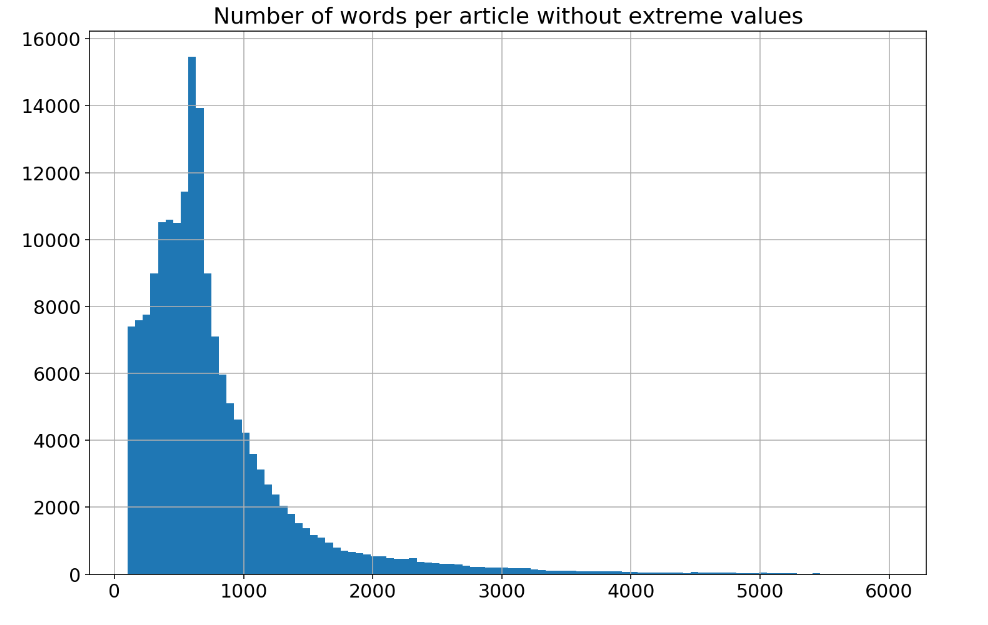
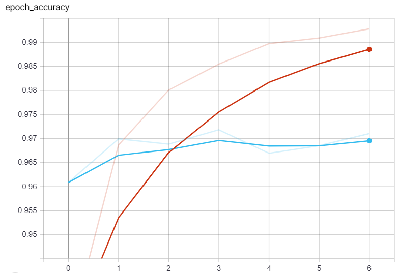
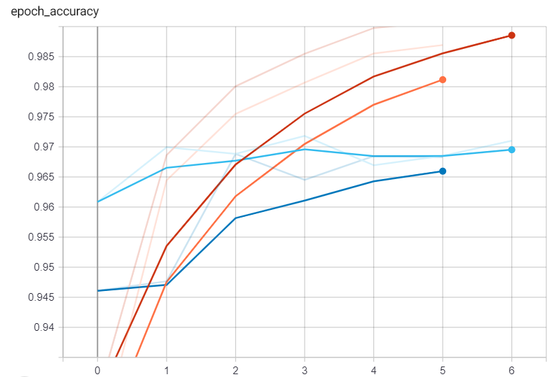
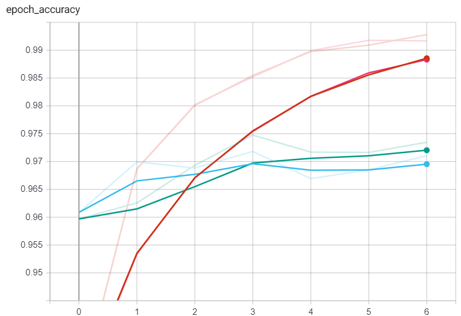
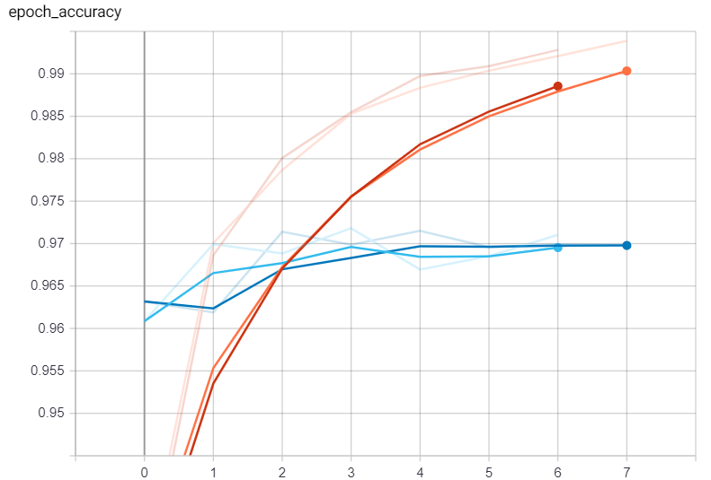
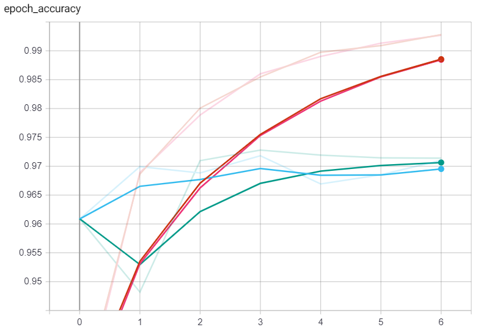
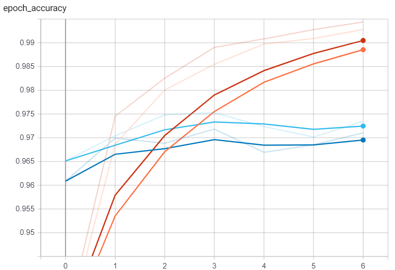
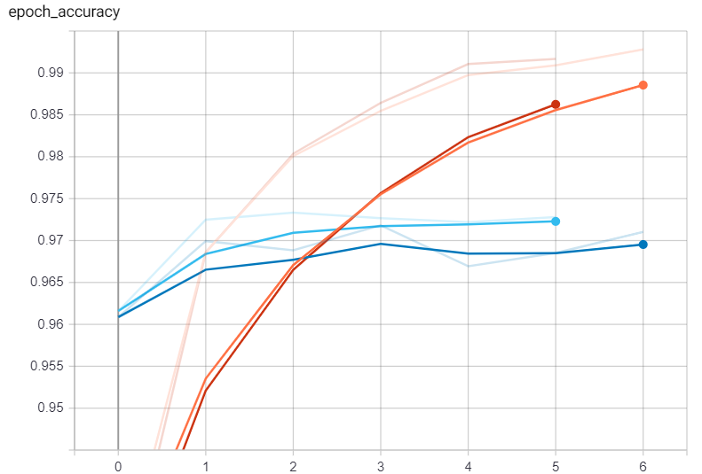

# Fake news detection
**Authors:** Peter Mačinec & Simona Miková

## Problem Statement
Our task is to classify news article reliability using recurrent neural network.  

*Given the article body as an input, our neural network model will classify its appropriate label (reliable/unreliable).”*

## Our model architecture 

Full architecture of our model is shown in the picture below: 

**Embedings layer**    
First layer in our model is Embedding layer. We are using pre-trained fastText embeddings as weigths initialization, but then it is not trainable. For words that are missing in fastText embeddings dictionary, zero vector is supplied. Sequences are then padded by zeros to max sequence length and before sending it to LSTM layer, we mask the added padding. By doing that, LSTM layer will ignore all 0 in sequences.

**Bidirectional LSTM layer**    
Next we are using Bidirectional LSTM layer, because we are dealing with longer textual data (articles). This layer has 64 units (this is also hyperparameter for us).

**Dense layer**   
Then we have Dense layer with ReLu activation function and same number of units as LSTM layer before. Number of these layers is hyperparameter and can be easily changed.

**Final Dense layer**  
Final layer is Dense layer with sigmoid activation function and 1 unit. It returns values from -1 to 1, which can determine whether article is fake or not.

## Baseline model and default parameters 

Our baseline model has architecture as described above. Default parameters are:  
* vocabulary size - based on fastText and input sequences
* dimension of embeddings - 300 (based on fastText pre-trained model) 
* optimizer - Adam by default

We also have not fixed params that can be tuned (hyperparams), listed in the next section.

### Hyperparameters

All of those parameters can be tuned to achieve best results:

* number of units in LSTM and Dense layers - 64 units by default 
* number of hidden Dense layers - 1 hidden layer by default 
* maximum words in vocabulary to use - 30 000 by default (based on the frequency of words and the ratio of found / not found words in fastText embedding)
* maximum length of all sequences - based on analysis of dataset we have set default value to 2500

## Experiments

### Dataset
We are using dataset from Monant platform. It contains medical articles acquired from a variety of sources. Data were cleaned during preprocessing and only body and label columns were kept. Label column were balanced  additionally (now containing 32855 records for each class). More about how does the data look like can be found in corresponding jupyter notebooks (included in this project).

### Training configuration

**Parameters of training**

In training we have been using these parameters:
* *Adam* as optimizer (this one can be also changed, because it is hyperparameter),
* *binary crossentropy* as loss function,
* *accuracy* as a metric.

**Model checkpoint**

All trainings produce also best model achieved during training. Only best model (according to *validation accuracy*) is saved from all training epochs.

**Early stopping**

Early stopping is used in our model training with following configuration:
* monitored value is *validation accuracy*,
* if model is not improving during 3 epochs, training is stopped.

### Training routine

After the first few trainings, our results were surprisingly good after just few epochs, so we decided to do another iteration of analysis and preprocessing to reveal possible data leaks. After this, the results have changed minimally.
Subsequently, we have trained our model again on the new data with the following settings for comparison:

1. Our baseline model
1. Model with LSTM only (without using bidirectional layer)
1. Set max_seq_len to 500
1. Using regularization
1. Setting number of hidden layers to 0
1. Setting number of LSTM units to 16
1. Setting number of LSTM units to 128
1. Setting number of LSTM units to 16 and not using Dense layer (most simple model)
1. Setting number of max_words to 10000 
1. Setting max words to 100000

### Training logs and results

The selection and hyperparameter tuning was based on our following goals (or on what we wanted to find out):
1. Impact of maximum sequence length on model prediction
1. Since model was performing quite well, we tried various alternatives. Mainly adjusting number of LSTM units and a number of hidden dense layers to see when the model is overtraining and when it can achieve good results
1. Use model without bidirectional layer to compare benefits of its usage
1. Impact of the maximum number of words on model prediction

All training results are compared with our baseline model mentioned in chapter *Our model architecture*.

1. Our baseline model

In the picture, we can see model accuracy for train (red) and validation (blue) dataset. We achieved quite good results just with our baseline model, so in next trainings, we decided to test some other hyperparameter settings, as was mentioned above.

2. Model with LSTM only (without bidirectional layer)

Baseline model - train (red), validation (blue)
Model from this training - train (orange), validation (dark blue)

From the results, we can see that our baseline model accuracy was higher than accuracy of model with LSTM layer only instead of bidirectional LSTM layer. So we can say, that the use of bidirectional LSTM layer is reasonable in this problem.

3. Using regularization

Baseline model - train (red), validation (blue)
Model from this training - train (pink), validation (green)

From the results, we can see, that using regularization had almost no effect on accuracy in comparison to our baseline model.

4. Set max_seq_len to 500

Baseline model - train (red), validation (blue)
Model from this training - train (grey), validation (orange)

Next, we decided to significantly reduce the number of max_seq_len (500 instead of 2500). The results are comparable to our baseline model results, but the training itself was shorter, because of early_stopping.

In the next 2 trainings, we decided to change the number of max_words parameter, to see the results. 

5. Setting number of max_words to 10000

Baseline model - train (red), validation (blue)
Model from this training - train (orange), validation (dark blue)

From the results, we can see that the model will learn correctly even with fewer words, which may be useful in terms of memory.

6. Setting max words to 100000

Baseline model - train (red), validation (blue)
Model from this training - train (pink), validation (green)

As we can see, a larger number of words has almost no effect on the training of the model, and therefore a smaller number of words is quite sufficient, which we can even confirm from the previous training.

In the next section are presented trainings we have tried, based on ... (bod 2):

7. Setting number of hidden layers to 0

Baseline model - train (orange), validation (dark blue)
Model from this training - train (red), validation (blue)

TODO doplnit zaver

8. Setting number of LSTM units to 16

Baseline model - train (orange), validation (dark blue)
Model from this training - train (pink), validation (green)

TODO doplnit zaver

9. Setting number of LSTM units to 128

Baseline model - train (red), validation (blue)
Model from this training - train (green), validation (grey)

TODO doplnit zaver

10. Setting number of LSTM units to 16 and not using Dense layer   

Baseline model - train (orange), validation (dark blue)
Model from this training - train (red), validation (blue)

TODO doplnit zaver

## Conclusion

To solve given problem we first analysed dataset to get basic knowledge and to find possible problems with data. We have fixed identified problems during preprocessing. Then we constructed our model and proceeded to training. 
During training we found out that: 
* even shorter sequences (500) have comparable results to using longer sequences
* bidirectional LSTM layers performs better than basic LSTM

Because our results were quite good from the beginning, we decided to take a closer look at the data again and reveal possible data leak (frequently repeating sentences in articles etc.). It turned out that removing detected repetitions did not modify our results (or just slightly). From this we concluded that this is either a very simple problem (and it may be, because in medicine data there are very specific topics for fake news and for reliable news) or we would need to perform multiple iterations of analysis and preprocessing. Also, the problem can be hidden in the way data annotated - by news articles source. Basically, each source is identified by themes of articles or even custom writing styles. In this case, we just need data annotated by experts or by another heuristic method.

## Future works

Working on this project for a couple of weeks, we also found some future works that can be done to improve fake news detection:   
* **using multimodal features** - our first proposal included also multimodal features (like images of articles or discussions), but they were not used because of time,       
* **evaluate model on different datasets** - according to annotation problems mentioned in conclusion, it would be appropriate to evaluate proposed neural network model on different   data.

